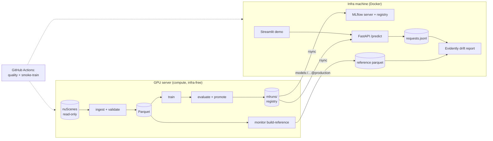

# nuscenes-data-engine

[](https://github.com/Sahilpatkar/nuscenes-data-engine/actions/workflows/ci.yml)

End-to-end **MLOps pipeline for autonomous-vehicle perception** on the
[nuScenes](https://www.nuscenes.org/) dataset. Raw multimodal sensor data is
ingested, validated, and versioned; a 2D object detector is trained, tracked, and
evaluated (with condition-sliced metrics); the production model is served behind an
API and monitored for drift — all tied together with CI/CD.

> The pipeline is the product. The model is deliberately simple; everything around it
> is deliberately production-grade. See [nuscenes-mlops-project-plan.md](nuscenes-mlops-project-plan.md)
> for the full design and rationale.

**📖 Full project documentation — objective, architecture, decisions, results,
model evaluations, use cases, and future scope: [docs/PROJECT.md](docs/PROJECT.md)**

## Status

**All 5 phases built.** Ingestion → validated Parquet, YOLO fine-tuning with MLflow
tracking, condition-sliced evaluation with gated registry promotion, the promoted model
(`nuscenes-yolo-detector@production`, yolov8m@960, val mAP50 0.740) served behind a
FastAPI + Streamlit demo, and Evidently drift monitoring over the serving inputs with a
two-job CI (quality + CPU smoke-train).

## Architecture



## Toolchain

- **Python 3.11**, managed with [`uv`](https://docs.astral.sh/uv/)
- Packaging: `pyproject.toml` (hatchling), `src/` layout
- Quality: `ruff` (lint + format), `mypy` (strict), `pytest`
- Infra (on the local infra machine): `docker-compose` (MinIO + MLflow), DVC, GitHub Actions

## Two-machine topology

Compute is split from ops so the GPU box never has to run infra:

| | **GPU server** (this repo's host) | **Local infra machine** |
|---|---|---|
| Has | the read-only nuScenes data + GPU | Docker |
| Runs | `ingest`, `train`, `evaluate` — **infra-free**, writes plain files | MinIO, MLflow server + registry, FastAPI serving, Streamlit, Evidently, CI |
| MLflow | logs to a local file store (`file:./mlruns`) | MLflow **server** owns the UI + model registry |
| DVC | never pushes | `dvc add`/`push` into MinIO |

**Remote execution:** run server-side stages straight from this repo — no manual
ssh/pull — via `scripts/gpu-run.sh` / `make gpu-embed` / `make gpu-train`, and pull
outputs back with `make sync-down`. Node inventory, GPU etiquette, and failure modes:
[docs/GPU_SERVER.md](docs/GPU_SERVER.md).

**Hand-off (rsync):** the server produces files; you sync them to the infra machine, which
owns all versioning/serving:

```bash
# on the infra machine — pull compute outputs off the GPU server:
rsync -a  user@gpu-server:/home/mgaur/sahil/nuscenes_project/data/processed/  ./data/processed/
rsync -a  user@gpu-server:/home/mgaur/sahil/nuscenes_project/mlruns/          ./mlruns/
# then, locally:
make infra-up                 # MinIO + MLflow
dvc add data/processed/*.parquet && dvc push
```

Nothing on the GPU server needs Docker/MinIO/an MLflow server. Point a run at the infra
host by overriding `MLFLOW_TRACKING_URI` in `.env` if the machines are reachable.

## Quickstart

```bash
uv sync --extra dev              # create .venv, install base + dev deps
uv run nuscenes-data-engine --help
uv run nuscenes-data-engine --version
uv run pytest                    # smoke tests pass green
```

Common tasks via the Makefile:

```bash
make setup      # uv sync --extra dev
make check      # ruff + mypy + pytest
make infra-up   # [infra machine only] start MinIO + MLflow (docker compose)
uv run pre-commit install   # one-time: enable the ruff/format/hygiene git hooks
```

Heavy dependencies are opt-in extras so the base install stays light:

```bash
uv sync --extra data    # Phase 1: nuscenes-devkit, Great Expectations, DVC, Evidently
uv sync --extra train   # Phase 2–3: torch, ultralytics, mlflow, dagster
uv sync --extra serve   # Phase 4: fastapi, uvicorn, streamlit
```

## Data

The nuScenes `v1.0-trainval` dataset is read (read-only) from
`/data/ggare/datasets/nuscenes/` — it is **not** copied into the repo. Configure the
path via `.env` (see [.env.example](.env.example)). Processed, DVC-tracked outputs go
under `data/processed/`.

## Repo layout

```
configs/                    experiment + pipeline configs (data/train/eval.yaml)
data/                       DVC-tracked pipeline outputs (raw/, processed/)
src/nuscenes_data_engine/
  ingestion/                devkit parsing, Parquet export, 3D→2D projection
  validation/               Great Expectations suites
  training/                 Dagster job + YOLO fine-tuning + MLflow
  evaluation/               mAP + condition-sliced metrics
  serving/                  FastAPI app
  monitoring/               Evidently drift reports
  data_engine/              SigLIP embeddings, LanceDB store, semantic search
app/                        Streamlit demo UI
tests/                      pytest suite
docs/                       DATA.md, EVALUATION.md
.github/workflows/          CI (ruff + mypy + pytest)
```

## Training (Phase 2)

Fine-tune a pretrained YOLO detector on the projected 2D boxes. The pipeline
`prepare dataset → train → log to MLflow` runs on the GPU server with no infra:

```bash
uv sync --extra data --extra train

# Build the YOLO dataset (image symlinks + labels + data.yaml) from the Parquet:
uv run nuscenes-data-engine prepare-dataset [--camera CAM_FRONT] [--limit-scenes N]

# Fine-tune + log params/metrics/weights/plots to a local MLflow (sqlite) store:
uv run nuscenes-data-engine train [--camera CAM_FRONT] [--limit-scenes N] \
                                  [--epochs N] [--device 0]
```

- Config-driven from [configs/train.yaml](configs/train.yaml); every run is reproducible
  from `(config + data-version hash)`, both logged to the trackers.
- The official nuScenes scene split is used for train/val.
- **MLflow** logs to `sqlite:///mlruns/mlflow.db` (no server needed); sync `mlruns/` to the
  infra machine to browse the UI and register/promote models.
- **Weights & Biases** (optional, cloud): add `--wandb` and set `WANDB_API_KEY` in `.env`
  (or `uv run wandb login`). Live metrics, PR curves, and validation-prediction images
  stream to your W&B project. `WANDB_MODE=offline` logs to `./wandb` for later `wandb sync`.
  Once configured, **every pipeline stage** logs a W&B run automatically (job types:
  `embed`, `evaluate`, `monitor-drift`, `autolabel-*`) — opt out per run with
  `--no-wandb`, or globally with `WANDB_MODE=disabled`.
- Orchestrated variant (Dagster):
  `uv run dagster dev -m nuscenes_data_engine.training.pipeline`.

## Serving (Phase 4)

The promoted model is served by a FastAPI app; a Streamlit demo calls it over HTTP
(the demo never loads the model itself — the same topology `docker compose up` runs).

```bash
uv sync --extra serve --extra train   # torch+ultralytics are needed for inference

# Run the API (loads models:/nuscenes-yolo-detector@production from mlruns/):
make serve                            # = uv run nuscenes-data-engine serve [--port 8000]

# No mlruns/ on this machine? Serve any local checkpoint instead:
SERVING_WEIGHTS=weights/yolov8n.pt uv run nuscenes-data-engine serve
```

```bash
curl -s localhost:8000/health
# {"status":"ok","model_loaded":true,"model_version":"2"}
curl -s -F file=@app/samples/day.jpg localhost:8000/predict          # detections JSON
curl -s -F file=@app/samples/day.jpg localhost:8000/predict/annotated -o boxes.png
```

- Knobs via `.env` (see [.env.example](.env.example)): `SERVING_IMGSZ` (960),
  `SERVING_CONF` (0.25), `SERVING_DEVICE` (`cpu`), `SERVING_WEIGHTS` (registry bypass).
- **Demo UI:** `uv run streamlit run app/streamlit_app.py` (set `API_URL` if the API
  isn't on `localhost:8000`). Upload an image or pick a bundled sample.
- **Samples:** `app/samples/` is gitignored (nuScenes imagery is non-commercially
  licensed) — populate it per machine, e.g. on the GPU server copy a few
  `samples/CAM_FRONT/*.jpg` frames (day/night/rain) from the dataset.
- **Docker (infra machine):** `docker compose up -d api streamlit` builds
  [docker/serving.Dockerfile](docker/serving.Dockerfile) and serves the API on :8000 and
  the demo on :8501, with `./mlruns` mounted for registry access.
- **Latency:** `uv run python -m nuscenes_data_engine.serving.benchmark
  --image app/samples/day.jpg -n 30` — yolov8n@960 on an M-series MacBook CPU:
  p50 30 ms / p95 32 ms; the production yolov8m@960: p50 93 ms / p95 107 ms.

## Monitoring (Phase 5)

Evidently drift reports over the serving inputs — brightness, resolution, and
detection-count distributions vs a training-data reference. Full design + demo results
in [docs/MONITORING.md](docs/MONITORING.md).

```bash
# on the GPU server (has the images) — build the reference feature table:
uv run nuscenes-data-engine monitor build-reference --condition day
# rsync data/processed/monitoring_reference.parquet to the infra machine, then:

make monitor    # drift report from the API's per-request capture (data/monitoring/)
uv run nuscenes-data-engine monitor report --current <features.parquet|requests.jsonl>
# -> runs/monitoring/drift_report.html + drift_summary.json
```

The API captures `{brightness, dims, n_detections, latency}` per request into a
gitignored JSONL (`SERVING_CAPTURE_PATH`, blank to disable). The night-vs-day demo
(`docs/MONITORING.md`) shows the report flagging brightness + detection-count drift.

## Scene search (Phase 6a)

Every camera keyframe is embedded with SigLIP2 into a LanceDB store; the API serves
text, image, and similar-frame queries over it, and the Streamlit demo gets a
**Scene search** tab (results render from thumbnails stored alongside the vectors, so
the demo needs no dataset access).

```bash
# on the GPU server (has the images):
uv run nuscenes-data-engine manifest        # availability check: metadata vs filesystem
uv run nuscenes-data-engine embed           # ~205K frames -> data/lancedb (~3 GB)
# rsync data/lancedb/ + data/processed/availability.parquet to the infra machine, then:

uv run nuscenes-data-engine search "construction zone at night" -k 5
curl "localhost:8000/search?q=pedestrian+crossing+in+rain&k=6"
uv run nuscenes-data-engine query "SELECT is_night, count(*) FROM samples GROUP BY 1"  # DuckDB
```

Analytics examples live in [docs/ANALYTICS.md](docs/ANALYTICS.md); the availability
manifest (why: radar/LiDAR-sweep files are absent on the server) is documented in
[docs/DATA.md](docs/DATA.md).

## Auto-labeling (Phase 6b)

A stratified 5,000-frame sample is labeled by Claude (`claude-haiku-4-5`, plus a
500-frame `claude-opus-4-8` comparison subset) through the Batch API with structured
outputs, then scored against nuScenes ground truth — condition flags, per-class object
counts, and cheap-vs-frontier labeler agreement. Methodology, sampling strategy, cost
(~$15), and the runbook: [docs/AUTOLABEL_EVAL.md](docs/AUTOLABEL_EVAL.md).

```bash
uv run nuscenes-data-engine autolabel sample            # stratified sample (deterministic)
uv run nuscenes-data-engine autolabel submit --dry-run  # sizing + cost, no API calls
uv run nuscenes-data-engine autolabel submit --yes      # paid run (needs ANTHROPIC_API_KEY)
uv run nuscenes-data-engine autolabel collect && uv run nuscenes-data-engine autolabel eval
```

## Chat with the dataset (Phase 6c)

A tool-calling LLM agent answers natural-language questions by writing DuckDB SQL
over the Parquet tables and running semantic vector search over the frame
embeddings — returning numbers *with example frames*, every query logged. Runs $0
on a local model (Ollama, `qwen2.5:14b`) and flips to the Claude API for
deployment via `CHAT_PROVIDER=anthropic`. Design, SQL-safety guard, and example
transcripts: [docs/DATASET_CHAT.md](docs/DATASET_CHAT.md).

```bash
brew install ollama && brew services start ollama && ollama pull qwen2.5:14b
uv run nuscenes-data-engine chat "How many night scenes are there per location?"
uv run nuscenes-data-engine chat -i     # REPL; or use the Streamlit "Ask the dataset" tab
```

### Branch protection (manual, one-time)

GitHub → Settings → Branches → Add rule for `main`: require a pull request before
merging + require status checks **quality** and **smoke-train** (they appear in the
picker after the first PR run).

## Build roadmap

| Phase | Focus | Deliverable |
|---|---|---|
| 1 ✅ | Data engineering | `make ingest` → validated Parquet dataset (204,894 imgs / 1M boxes) |
| 2 ✅ | Training pipeline | Config-driven YOLO fine-tuning, MLflow-tracked, Dagster job |
| 3 ✅ | Evaluation & registry | Condition-sliced mAP (night/rain) + MLflow registry promotion |
| 4 ✅ | Serving | FastAPI + Streamlit demo via `docker compose up` |
| 5 ✅ | Monitoring & CI/CD | Evidently drift demo (day vs night) + 2-job CI (quality, smoke-train) |
| 6a ✅ | Scene search | SigLIP embeddings → LanceDB; text/image search API + Streamlit tab |
| 6b ✅ | VLM auto-labeling | 5K frames labeled by self-hosted Qwen2.5-VL ($0); night F1 0.99, counts degrade with crowding — see AUTOLABEL_EVAL.md |
| 6c ✅ | Dataset chat | Tool-calling agent (guarded DuckDB SQL + vector search), $0 local Ollama with a Claude-API deploy flip — see DATASET_CHAT.md |
| 6d ✅ | Active learning | Mined-vs-random controlled retrain: random +0.034 mAP beat similarity-mining +0.016 (diversity wins) — see ACTIVE_LEARNING.md |

Future work: Terraform-provisioned cloud deployment of the serving stack.

## License

MIT
